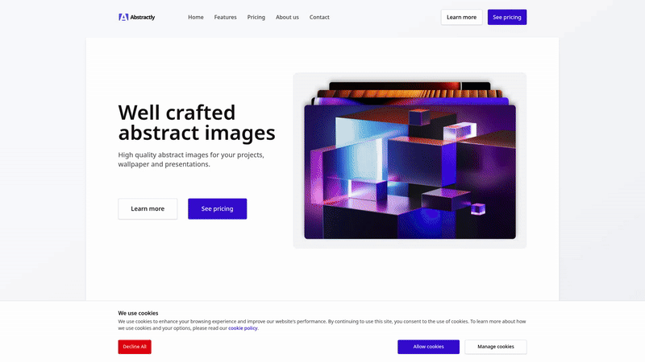

# Hi there 👋, I'm Jordan

Welcome to my GitHub profile! I'm a Frontend Developer.

## 🛠️ Skills

- **Languages:** JavaScript / TypeScript
- **Frameworks:** React / Next.js / React Native
- **Styling:** CSS / TailwindCSS / Styled Components
- **Backend:** REST APIs / WebSockets / MongoDB

## 🚀 Featured Projects

<!--
Copy & fill this template for each project:
### [Project Name](project_repo_url)
**Description:**
Briefly describe what this project is about.

**Tech Stack:**
- List main technologies used

**Links:**
- [Code](project_repo_url)
- [Live Demo](demo_url)
-->

### Abstractly - A responsive marketing website built with Next and TailwindCSS

- [Code](https://github.com/jordhan2k/gfe-portfolio/tree/main/apps/gfe-marketing)
- [Live Demo](https://gfe-portfolio-marketing.vercel.app/)

  

  

## 📫 Get in Touch

- Email: dzunght.dev@gmail.com
- [LinkedIn](https://www.linkedin.com/in/dzunght)

Thanks for stopping by! Feel free to explore my repositories and connect if you want to collaborate or just say hi.
